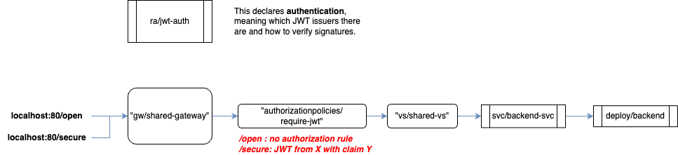

# Istio Usage Scenarios

This repository illustrates some interesting usage scenarios for Istio. This project assumes that Docker Desktop is running a K8S cluster.

## Preparing the Workbench by Installing & Wiping Istio

Basic setup to ensure there is a pristine K8S cluster:

1. `curl -L https://istio.io/downloadIstio | sh -`, rename the folder to `istio-dist`
1. In Docker Desktop spin up a K8S cluster;
2. Under Settings/Kubernetes, run `Reset Cluster`.
3. Execute `./baseline.sh`

## Scenario 1: Routing by Host and URI

This scenario use a `Gateway` and 2 `VirtualService`s to route to two backend `Deployment`s. These are the FQDNs:

* `first.istiodemo.io>`
* `second.istiodemo.io`

Each offer 2 paths each of which points to a deployment.

* `$HOST/order` -> `order-microservice`
* `$HOST/user`  -> `user-microservice`


Roll out and testing:

```
cd scenario1
kubectl apply -f setup.yaml
./ping.sh

# remove scenario
./remove-scenario.sh
```

## Scenario 2: Canary Deployment to Test a New Version

This scenario has two `Deployment`s of the same application, with different `version` labels. One of the versions is to be tested on 10% of the requests. 

Two `Service`s expose the `Deployment`s respectively. With the help of a `VirtualService`, there is a weighted distribution between the two applications, achieving the canary behaviour.


```
cd scenario2
kubectl apply -f setup.yaml
./ping.sh

# remove scenario
./remove-scenario.sh
```

## Scenario 3: Load Balancing Across Service Subgroups

This scenario has one applications deployed, but in 3 `Deployment`s with different labels. The label reflects a zone they are deployed in but the label could be anything actually. There is a single `Service` that spans across all application pods. In front of the service is a `DestinationRule`, which will break down the pods into subgroups (by label). Then, load balancing happens between these subgroups.

So we see that the `Service` can be oblivious to the finer grouping logic, with the `DirectionRule` helping to fine-tune the routing.

Problem with this scenario: I don't know yet how to prove LB settings within a subgroup (e.g. globally `RANDOM`, but in subgroup `ROUND_ROBIN`).

```
cd scenario3
kubectl apply -f setup.yaml
./ping.sh

# remove scenario
./remove-scenario.sh
```

## Scenario 4: Timeouts


In this scenario, there are 2 applications deployed: a BFF and a BACKEND. The backend is kinda slow, so we play with timeout settings here.
Timeouts are configured per destination in a `VirtualService`. Whenever a timeout occurs, you get a `504 Gateway Timeout`.

To illustrate different ways of utilizing this, this setup comes with a whopping 4 `VirtualService`s:

* `vs/bff-vs`: this is bound to the gateway and exposes the BFF only. The BFF invokes the BACKEND
* `vs/internal-backend-with-timeout-vs`: this is NOT bound to a gateway (it took me a while to figure this detail out), making it an internal VS. It has a timeout configuration. It sits between clients of BACKEND.
* `vs/external-backend-with-timeout-vs`: simply to illustrate that one can also have a timeout setting when calling from a gateway, this VS exists.
* `vs/external-backend-without-timeout-vs`: this exposes BACKEND to the gateway, but without the timeout setting.

You'll run 3 tests:
* call BFF: this times out
* call BACKEND with a strict timeout setting: this times out
* call BACKEND without a timeout setting: this works

```
cd scenario3
kubectl apply -f setup.yaml
./ping.sh

# remove scenario
./remove-scenario.sh
```


## Scenario 5: Retries

In this scenario, there are 2 applications deployed: a BFF and a BACKEND. The backend returns `500` with an error rate of 50%. The goal is to show how to silently retry this for calls from BFF as well as for external calls.

This scenario comes with 3 `VirtualService` to be able to demonstrate the different angles.

You'll run 3 tests:
* call BACKEND without retries: you see 50% `500`
* call BFF with retries: you see only `200` because the 3 retries will swallow any `500`
* call BACKEND with retries: again, you only see `200`


## Scenario 6: End User AuthX with JWT

This scenario is pretty much a recreation of [this how-to](https://istio.io/latest/docs/tasks/security/authorization/authz-jwt/). 
We have a BACKEND application running that has an `/open` endpoint (open for all) and a `/secure` endpoint that is meant to be secured with OpenID Connect.

You'll run 4 tests:
* access `/open` without a JWT but with the allowed HTTP method (`POST`)
* access `/secure` without a JWT
* access `/secure` with a valid JWT that is lacking a required claim
* access `/secure` with a valid JWT that has the expected claim



## Scenario 7: Service to Service AuthX

We have a hidden BACKEND application running in namespace `blue`, which has an `/open` endpoint (open for all) and a `/secure` endpoint that is only to be called from namespace `green`. In `ns:green` as well as `ns:red`, there are two separate BFF applications running, each of which trying to connect to <http://backend-svc.blue.svc.cluster.local:8000/secure>. Only calls from `green` are allowed.

Some things to note:
* client and host must be "on Istio", otherwise the participants are without identity and authorization fails
* authorization rules can be complex and take source, destination, paths, headers and such into account
* the mTLS certificate can be forwarded to upstream as a HTTP header, but this behaviour has to be configured (details [here](https://istio.io/latest/docs/ops/configuration/traffic-management/network-topologies/#forwarding-external-client-attributes-ip-address-certificate-info-to-destination-workloads))

You'll run 2 tests:
* call BFF in `red` using `Host: broken.istiodemo.io` and see this fail due to `403` from BACKEND
* call BFF in `green` using `Host: works.istiodemo.io` and see this work


## Other Scenarios

1. circuit breaking
